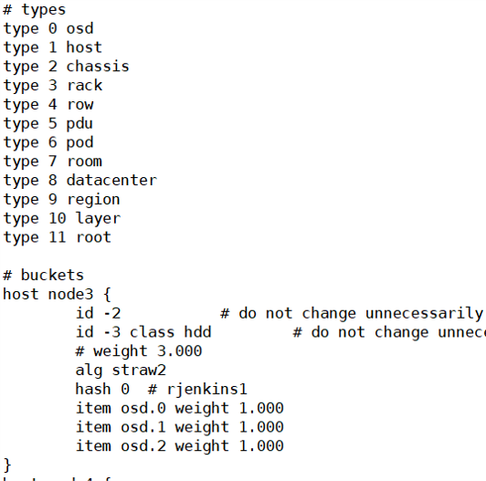
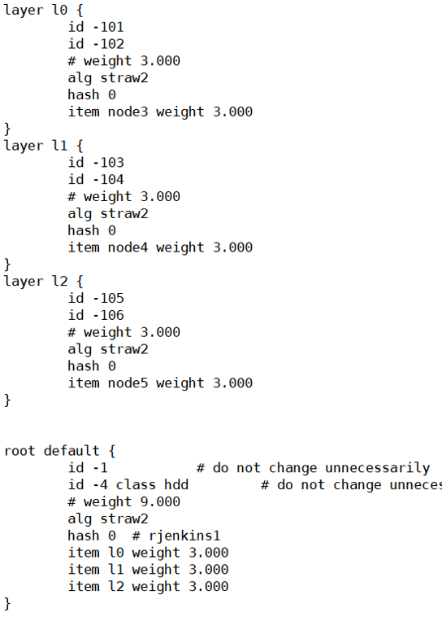

# MapX

### 安装

在 [Index of /tarballs/ (ceph.com)](http://download.ceph.com/tarballs/) 下载 `ceph-12.2.13.tar.gz` 并解压（其他版本不保证可以编译运行），使用本仓库中 `src` 下的文件替换解压后文件夹中的相同文件。

参考 [ceph/ceph: Ceph is a distributed object, block, and file storage platform (github.com)](https://github.com/ceph/ceph) 安装依赖包，并进行编译。

### 运行

安装好之后在 build 目录下使用 `../src/vstart.sh --debug --new -x --localhost --bluestore` 命令启动一个测试集群，MapX 会在启动时创建 3 个 layer。

使用 `ceph osd getcrushmap -o {compiled-crushmap-filename}` 命令获取集群的 CRUSH Map 并输出（ -o ）到指定的文件。再使用 `crushtool -d {compiled-crushmap-filename} -o {decompiled-crushmap-filename}` 命令反编译 CRUSH Map。

参考图片中的 CRUSH Map 添加 layer 并修改集群的存储结构。

使用 `crushtool -c {decompiled-crush-map-filename} -o {compiled-crush-map-filename}` 命令编译修改后的文件。最后使用 `ceph osd setcrushmap -i  {compiled-crushmap-filename}` 命令将其应用到集群。

创建新的 pool，使用 `rados -p pool-name put object-name filename` 命令写入对象进行测试。